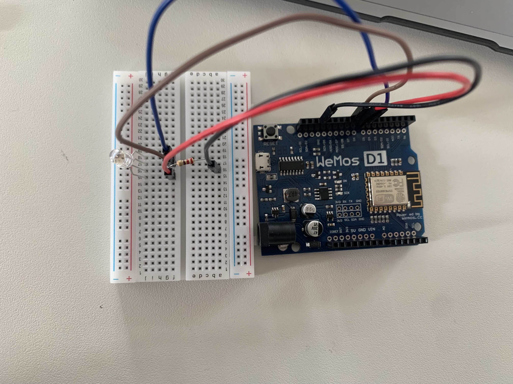

# SmartLight

Das Ziel dieses Projekts ist es, eine RGB-Lampe zu entwickeln, die über ein Smartphone gesteuert werden kann. Die Steuerung erfolgt über einen ColorPicker in Node-Red, der mit einem MQTT-Knoten verbunden ist. Die übermittelten Daten haben das Format "rgb(255, 255, 255)", wobei die Reihenfolge der Farben Rot, Grün und Blau ist. 
Der ESP8266 soll diese Daten empfangen, die Farbwerte extrahieren und die RGB-LED entsprechend einstellen.

### Index
<ol>
   <li><a href="#HardwareAufbau">Hardware / Aufbau</a></li>
   <li><a href="#">Hardware komponenten</a></li>
   <li><a href="#">Software</a></li>
   <li><a href="#">Beispielbild</a></li>
   <li>
      <a href="#">Projektdurchführung</a>
      <ol>
         <li><a href="#">Die Bibliotheken importieren</a></li>
         <li><a href="#">Die pins definieren</a></li>
         <li><a href="#">Die wichtige Variablen definieren</a></li>
         <li><a href="#">Die wichtige Variablen definieren</a></li>
         <li><a href="#">Einrichtung der WLAN-Verbindung des ESP8266 mit dem Netzwerk.</a></li>
         <li><a href="#">Verbindung des ESP8266 mit dem MQTT-Broker und Abonnement des Topics "rgb".</a></li>
         <li><a href="#">Implementierung einer Callback-Funktion, die aufgerufen wird, wenn eine Nachricht über MQTT empfangen wird.</a></li>
         <li><a href="#">Extraktion der RGB-Farbwerte aus der empfangenen Nachricht und Anpassung der Helligkeit und Einstellung der RGB-LED entsprechend den extrahierten Farbwerten.</a></li>
         <li><a href="#">Die Funktionen in Setup/Loop-Funktion aufrufen</a></li>
         <li><a href="#">Node-Red einrichten</a></li>
         <li><a href="#">Die Topic in Node-Red einrichten</a></li>
       </ol>
   </li>
   <li><a href="#">Qualitätssicherung/Tests</a></li>
   <li><a href="#">Hinweise zur realen Umsetzung</a></li>
</ol>

<h2 id="HardwareAufbau">Hardware / Aufbau</h2>
Die Hardware besteht aus einem ESP8266-Mikrocontroller, einer RGB-LED, Resistor 1k Ω, Test-Board und Kabel. 
Die RGB-LED wird mit den Pins D5, D6 und D7 des ESP8266 verbunden, die jeweils die Farben Blau, Rot und Grün steuern. 
Der ESP8266 wird über WLAN mit dem Netzwerk verbunden und kommuniziert über MQTT mit dem Raspberry Broker.

### Hardware komponenten:
    * WeMos D1 R2 WiFi ESP8266
    * Test-Board
    * RGB LED
    * Resistor 1k Ω
    * Kabel
    * Raspberry pi 400
    * Access Point -> Wlan
### Software:
    * MQTT -> mosquitto
    * Nodejs: >= 18
    * Node-red

### Beispielbild:



## Projektdurchführung
1. Die Bibliotheken importieren
```cpp
#include <ESP8266WiFi.h>  // Bibliothek für die WiFi Funktionen
#include <PubSubClient.h> // Bilbiothek für MQTT Funktionen
#include <WiFiUdp.h>
```

2. Die pins definieren
```cpp
#define ledBlue D5
#define ledRed D6
#define ledGreen D7
```
4. Die wichtige Variablen definieren
```cpp
// WiFi
const char* ssid = "EVP-LF7";
const char* wifi_password = "APevpLF7";

// MQTT
const char* mqtt_server = "ssf.local";
const char* mqtt_topic = "rgb"; 
const char* mqtt_username = "ssf";
const char* mqtt_password = "a123123@";
const char* clientID = "";

// Initialisiere Wifi und MQTT
WiFiClient wifiClient;
PubSubClient client(mqtt_server, 1883, wifiClient); // 1883 ist der Port für den Broker

```

5. Einrichtung der WLAN-Verbindung des ESP8266 mit dem Netzwerk.
```cpp
void setupWiFi() {
  Serial.print("Connecting to ");
  Serial.println(ssid);

  // Stellt Verbindung mit dem Netzwerk her
  WiFi.begin(ssid, wifi_password);

  // Warten bis die Verbindung aufgebaut ist
  while (WiFi.status() != WL_CONNECTED) {
    delay(500);
    Serial.print(".");
  }

  // Ausgabe der IP Adresse des ESP
  Serial.println("WiFi connected");
  Serial.print("IP address: ");
  Serial.println(WiFi.localIP());
}
```

6. Verbindung des ESP8266 mit dem MQTT-Broker und Abonnement des Topics "rgb".
```cpp
void setupMQTT() {
  // Verbindung mit MQTT Broker (Mosquitto)
  if (client.connect(clientID, mqtt_username, mqtt_password)) {
    Serial.println("Connected to MQTT Broker!");
  }
  else {
    Serial.println("Connection to MQTT Broker failed...");
  }

  // callback Funktion wird aufgerufen, sobald ein abonniertes Topic eine Nachricht vom Broker erhält.
  client.setCallback(callback);
  client.subscribe(mqtt_topic);
}
```

7. Implementierung einer Callback-Funktion, die aufgerufen wird, wenn eine Nachricht über MQTT empfangen wird.
```cpp
void callback(String topic, byte* message, unsigned int length) {
  Serial.println(topic);
  String msg;
  for (int i=0; i<length; i++) {
    // Serial.print((char)message[i]);
    msg += (char)message[i];
  }
  Serial.println();
  readRGB(msg);
}
```

8. Extraktion der RGB-Farbwerte aus der empfangenen Nachricht und Anpassung der Helligkeit und Einstellung der RGB-LED entsprechend den extrahierten Farbwerten.
```cpp
void readRGB(String rgbString){

  rgbString.replace("rgb", "");
  rgbString.replace("(", "");
  rgbString.replace(")", "");
  rgbString.trim();
  
  int comma1 = rgbString.indexOf(",");
  int comma2 = rgbString.lastIndexOf(",");

  int R = rgbString.substring(0, comma1).toInt();
  int G = rgbString.substring(comma1 + 1, comma2).toInt();
  int B = rgbString.substring(comma2 + 1).toInt();
  
  if(R < 0 ) R = 0;
  if(G < 0 ) G = 0;
  if(B < 0) B = 0;

  analogWrite(ledRed,   R > 250 ? 250 : R);
  analogWrite(ledGreen, G > 250 ? 250 : G);
  analogWrite(ledBlue,  B > 250 ? 250 : B);
}
```

9. Die Funktionen in Setup/Loop-Funktion aufrufen
```cpp
void setup() {
  Serial.begin(115200);
  setupWiFi();
  setupMQTT();
}

void loop() {
  if (!client.connected()) setupMQTT();
  client.loop();
}
```

10. Node-Red einrichten


11. Die Topic in Node-Red einrichten


## Qualitätssicherung/Tests
Die Qualitätssicherung umfasst die Überprüfung der ordnungsgemäßen Funktion der RGB-Lampe. Hierbei werden verschiedene Farben über den ColorPicker in Node-Red ausgewählt und die Reaktion der RGB-LED überprüft. Es werden auch Grenzfälle getestet, um sicherzustellen, dass das System robust und zuverlässig ist.


Oder Farben können mithilfe von Mosquito simuliert werden:
```bash
mosquitto_pub -h XX.XX.XX.XX -u XxX -P XxX -p 1883 -t rgb -m "15" -q 1
```

## Hinweise zur realen Umsetzung
Bei der realen Umsetzung sollten folgende Punkte beachtet werden:

- Die richtige Verkabelung der RGB-LED mit dem ESP8266.
- Die korrekte Konfiguration der WLAN-Verbindung und des MQTT-Brokers.
- Die Sicherstellung, dass der ESP8266 eine stabile Verbindung zum WLAN und zum MQTT-Broker aufrechterhält.
